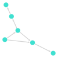

# Tutorials

## Directed Acyclic Graphs (DAGs) Tutorial

A Directed Acyclic Graph (DAG) is a finite directed graph with no directed cycles. This means that it is impossible to start at any node and follow a consistently directed sequence of edges that eventually loops back to the starting node. DAGs are widely used in various applications, such as representing dependencies in task scheduling, data processing pipelines, and more.

### Basic Concepts

- **Node**: A point in the graph where edges meet.
- **Edge**: A directed connection between two nodes.
- **Path**: A sequence of edges that connect a sequence of nodes.
- **Cycle**: A path that starts and ends at the same node. In a DAG, cycles are not allowed.

### Example 1: Simple DAG

Consider a simple DAG with 2 nodes.
In this graph:
- Node `A` has edges to `B`.
- Node `B` has no outgoing edges.
```julia
using Graphs
using GraphPlot
using Compose

g = SimpleDiGraph(2)
add_edge!(g,1,2)

p = gplot(g)
```
The above code produces this output:


### Example 2: Complex DAG
Consider a bigger DAG with 6 vertices:
```julia
g = SimpleDiGraph(6)

# Add edges
add_edge!(g, 1, 2)  # A -> B
add_edge!(g, 1, 3)  # A -> C
add_edge!(g, 2, 3)  # B -> C
add_edge!(g, 2, 4)  # B -> D
add_edge!(g, 3, 5)  # C -> E
add_edge!(g, 4, 6)  # D -> F

# Visualize the graph
p = gplot(g)

```
The above code produces this output:


### Test For DAG
To check whether a graph is a DAG or not, use the `simplecycleslength(dg::DiGraph, ceiling = 10^6)` function. 
```julia
julia> simplecycleslength(g)
([0, 0, 0, 0, 0, 0], 0)
```


